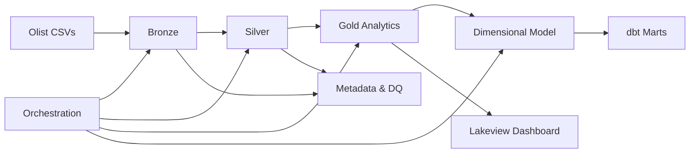

<div align="center">

# GlobalMart — E-Commerce Analytics

### End-to-end medallion data pipeline on Databricks for the Olist Brazilian E-Commerce dataset


[Overview](#overview) • [Features](#features) • [Architecture](#architecture) • [Tech Stack](#tech-stack) • [Quick Start](#quick-start) • [Pipeline](#pipeline-orchestration) • [Dashboard](#dashboard) • [Local Development](#local-development) • [Project Structure](#project-structure) • [Notebooks](#notebooks) • [Documentation](#documentation)

</div>

---

## Overview

GlobalMart is a production-style analytics pipeline built on the [Olist Brazilian E-Commerce](https://www.kaggle.com/datasets/olistbr/brazilian-ecommerce) dataset. It implements the medallion architecture — Bronze ingestion, Silver quality and entities, Gold analytics and star schema — with observability, Delta Lake operations, dbt transformations, and orchestrated end-to-end runs on Databricks.

Verified metrics, run reports, and test results: [`Result.md`](Result.md)

---

## Features

- **Medallion pipeline** — Bronze → Silver → Gold with catalog `globalmart` and JSON run reports per task.
- **Data quality & DLQ** — Rule-based checks on bronze with dead-letter queue and reconciliation gates.
- **Star schema** — `gold.fact_sales` (**110,197** rows · **R$15.4M** revenue) with SCD Type 2 customer dimension.
- **dbt layer** — Staging, marts, incremental fact, snapshots — **9/9** models · **26/26** tests.
- **End-to-end orchestration** — Seven-task pipeline with idempotency, dry-run, and failure-demo widgets.
- **Lakeview dashboard** — Five charts over the gold star schema (revenue, geography, delivery, categories, sellers).
- **Local verification** — **6/6** unit tests and Airflow pattern demos without Databricks ([`docs/LOCAL_SETUP.md`](docs/LOCAL_SETUP.md)).

---

## Highlights

| Area | Result |
|------|--------|
| Star schema | `gold.fact_sales` — **110,197** rows · **R$15.4M** revenue |
| Reconciliation | **all_passed: true** (99,441 order keys) |
| dbt | **9/9** models · **26/26** tests |
| End-to-end pipeline | **7/7** tasks SUCCESS |
| Dashboard | [GlobalMart Sales Analytics (Lakeview)](https://dbc-a54a680a-a023.cloud.databricks.com/dashboardsv3/01f16f20d20b18a78431d3f7d22e6ccc/published?o=7474660156362188) |
| Local verification | **6/6** unit tests · Airflow pattern demos |

---

## Architecture



**Layers:** Bronze → Silver → Gold → Observability → Dimensional → Delta ops → dbt → Orchestration

**Catalog:** `globalmart` · **Schemas:** `bronze`, `silver`, `gold`, `metadata`  
**Run reports:** `/Volumes/globalmart/metadata/run_reports/` (JSON per notebook/task)

Lineage details: [`docs/LINEAGE.md`](docs/LINEAGE.md)

---

## Tech Stack

| Layer | Tools |
|-------|--------|
| Platform | Databricks (Free Edition compatible), Unity Catalog |
| Storage & compute | Delta Lake, Apache Spark, Auto Loader |
| Transformations | PySpark (`src/`), dbt (staging, marts, incremental fact, snapshot) |
| Quality & metadata | Custom DQ engine, DLQ, reconciliation, run report JSON |
| Orchestration | Databricks notebook chain (`00_run_full_pipeline`), optional Workflow job, local Airflow patterns |
| Visualization | Databricks Lakeview (SQL in `dashboard/`) |
| Local dev | Python 3.11+ venv, pytest, Podman (optional Airflow UI) |

---

## Quick Start

### Prerequisites

- Databricks workspace with Unity Catalog
- Olist dataset: **8 CSV files** (Kaggle)
- For dbt notebook: `dbt/profiles.yml` (gitignored, configure locally)
- For PC verification: Python 3.11+, optional Podman

### 1. Databricks setup

1. Clone this repo into **Databricks Repos** ([`Harshdev625/ecommerce-analytics`](https://github.com/Harshdev625/ecommerce-analytics)).
2. Run [`config/catalog_setup.sql`](config/catalog_setup.sql) to create catalog `globalmart`.
3. Upload CSVs to `/Volumes/globalmart/bronze/raw_landing/`.
4. Run notebooks **`01_bronze/` → `10_orchestration/`** in order, **or** open **`notebooks/10_orchestration/00_run_full_pipeline.ipynb`** for end-to-end (**7/7** tasks).
5. Configure `dbt/profiles.yml` locally before `09_dbt/01_dbt_setup_and_run.ipynb`.
6. **Dev loop:** edit on PC → `git push` → Databricks Repos **Pull** (avoid Commit & Push from Databricks UI).

### 2. Local verification (optional)

```powershell
cd path\to\ecommerce-analytics
.\scripts\setup_local.ps1
.\scripts\run_local_verification.ps1
```

Optional Airflow UI (Podman):

```powershell
podman compose -f podman/compose.yaml up
```

Full guide: [`docs/LOCAL_SETUP.md`](docs/LOCAL_SETUP.md)

---

## Pipeline orchestration

Production flow lives in `notebooks/10_orchestration/` with reusable code in `src/orchestration/`.

```text
00_run_full_pipeline
  ├── 01_bronze_ingestion      → idempotent CSV load
  ├── 02_quality_checks        → DQ on bronze.orders
  ├── 03_silver_transforms     → silver entities + DLQ gate
  ├── 04_reconciliation        → bronze vs silver (3-level)
  ├── 05_gold_aggregations     → daily summary + seller performance
  ├── 06_dimensional_refresh   → star schema rebuild
  └── 07_visualization         → dashboard datasets
```

| Control | Purpose |
|---------|---------|
| `pipeline_run_id` | Correlates JSON run reports |
| `dry_run` | Validate without writes |
| `simulate_failure` | Set `silver_transforms` to demo downstream skip (Task 10.1) |

**Run on Databricks:** `00_run_full_pipeline.ipynb` chains all seven via `dbutils.notebook.run`.

**Optional:** Workflow job [`config/workflows/globalmart_pipeline.job.json`](config/workflows/globalmart_pipeline.job.json) · Local Airflow [`airflow/dags/`](airflow/dags/) · pattern demo [`scripts/demo_airflow_patterns.py`](scripts/demo_airflow_patterns.py)

---

## Dashboard

[GlobalMart Sales Analytics (Databricks Lakeview)](https://dbc-a54a680a-a023.cloud.databricks.com/dashboardsv3/01f16f20d20b18a78431d3f7d22e6ccc/published?o=7474660156362188)

Five charts over the gold star schema: revenue trend, revenue by state, delivery performance, top categories, top sellers.

SQL & setup: [`dashboard/lakeview_queries.sql`](dashboard/lakeview_queries.sql) · [`dashboard/README.md`](dashboard/README.md)

---

## Local development

PC-only tests and demos live under `local/` (gitignored). Databricks integration tests remain in `tests/`.

| Command | What it runs |
|---------|----------------|
| `scripts/setup_local.ps1` | venv + `requirements-dev.txt` |
| `scripts/run_local_verification.ps1` | **6/6** pytest + Airflow pattern demo |
| `scripts/demo_airflow_patterns.py` | Idempotency, sensors, backfill, failure recovery |
| `podman compose -f podman/compose.yaml up` | Optional Airflow UI |

See [`docs/LOCAL_SETUP.md`](docs/LOCAL_SETUP.md) · [`airflow/README.md`](airflow/README.md)

---

## Project Structure

```text
ecommerce-analytics/
├── README.md
├── Result.md                 # Verified metrics & deliverable sign-off
├── config/
│   ├── catalog_setup.sql
│   └── workflows/globalmart_pipeline.job.json
├── notebooks/                # 01_bronze … 10_orchestration
├── src/                      # Python modules per layer
├── dbt/                      # Staging, marts, incremental fact, snapshot
├── dashboard/                # Lakeview SQL
├── airflow/dags/             # Local orchestration DAGs
├── tests/                    # Databricks unit tests (full DQ rules)
├── scripts/                  # Local setup and verification
├── docs/                     # Lineage and local setup guides
└── podman/                   # Optional Airflow compose
```

---

## Notebooks

### `01_bronze/` — ingestion

| Notebook | Purpose |
|----------|---------|
| `01_idempotent_ingestion.ipynb` | Batch load with fingerprint-based idempotency |
| `02_auto_loader_orders.ipynb` | Auto Loader ingestion for orders |
| `03_nested_payments.ipynb` | Nested and flattened payment structures |
| `04_schema_evolution.ipynb` | Schema evolution and violation logging |

### `02_spark_performance/` — Spark optimization

| Notebook | Purpose |
|----------|---------|
| `01_execution_plan_diagnostics.ipynb` | Predicate, join, shuffle diagnostics |
| `02_skew_detection.ipynb` | Data skew analysis and remediation |
| `03_higher_order_functions.ipynb` | Higher-order functions vs explode patterns |

### `03_silver_quality/` — silver layer

| Notebook | Purpose |
|----------|---------|
| `01_data_quality_dlq.ipynb` | Data quality rules and dead-letter queue |
| `02_silver_orders.ipynb` | Orders, late arrivals, reconciliation |
| `03_silver_order_items.ipynb` | Order item enrichment |
| `04_silver_customers_sellers.ipynb` | Customer and seller deduplication |

### `04_joins_cdc/` — joins and CDC

| Notebook | Purpose |
|----------|---------|
| `01_business_join_questions.ipynb` | Business analytics queries with join rationale |
| `02_broadcast_join_control.ipynb` | Join strategy comparison |
| `03_skew_distribution_report.ipynb` | Skew distribution reporting |
| `04_cdc_customers_merge.ipynb` | Customer CDC with Delta MERGE |

### `05_gold_analytics/` — gold metrics

| Notebook | Purpose |
|----------|---------|
| `01_daily_sales_metrics.ipynb` | Daily revenue, moving averages, rankings |
| `02_customer_rfm.ipynb` | RFM segmentation |
| `03_category_growth_streaks.ipynb` | Category growth streak analysis |
| `04_customer_summary_merge.ipynb` | Customer lifetime summary MERGE |
| `05_incremental_loader.ipynb` | Watermark-based incremental loading |

### `06_gold_observability`

| Notebook | Purpose |
|----------|---------|
| `01_materialized_views.ipynb` | View materialization performance |
| `02_gold_aggregations.ipynb` | Daily/monthly gold aggregations |
| `03_streaming_orders.ipynb` | Streaming orders table |
| `04_dynamic_views.ipynb` | Column masking & row-level security |

Code: `src/gold_observability/`

### `07_dimensional/` — star schema

| Notebook | Purpose |
|----------|---------|
| `01_date_dimension.ipynb` | Date dimension |
| `02_surrogate_key_strategy.ipynb` | Surrogate key strategy comparison |
| `03_product_dimension.ipynb` | Product dim (SCD Type 1) |
| `04_seller_dimension.ipynb` | Seller dim (SCD Type 1) |
| `05_customer_dimension_scd2.ipynb` | Customer dim (SCD Type 2) |
| `06_fact_sales.ipynb` | Fact table + validation |
| `07_star_schema_query.ipynb` | Multi-dimensional analytics query |

### `08_delta_ops/` — Delta Lake operations

| Notebook | Purpose |
|----------|---------|
| `01_small_files_optimize.ipynb` | Small-file compaction, OPTIMIZE |
| `02_partition_zorder.ipynb` | Partitioning & Z-ORDER |
| `03_vacuum.ipynb` | VACUUM |
| `04_time_travel.ipynb` | Time travel & RESTORE |
| `05_liquid_clustering.ipynb` | Liquid clustering evaluation |

### `09_dbt/` — dbt transformations

| Item | Purpose |
|------|---------|
| `dbt/` | Staging, marts, incremental fact, snapshots, tests |
| `01_dbt_setup_and_run.ipynb` | dbt install, run, test, snapshot, docs generate |

Requires `gold.dim_*` from `07_dimensional/`.

### `10_orchestration/` — pipeline

| Notebook | Purpose |
|----------|---------|
| `00_run_full_pipeline.ipynb` | **End-to-end runner (7 tasks)** |
| `01_bronze_ingestion.ipynb` … `07_visualization.ipynb` | Individual pipeline tasks |
| `08_workflow_runbook.ipynb` | Workflow & Free Edition notes |

Code: `src/orchestration/`

---

## Documentation

| Document | Purpose |
|----------|---------|
| [`Result.md`](Result.md) | Verified run metrics, E2E **7/7**, dbt **26/26**, failure demo notes |
| [`docs/LINEAGE.md`](docs/LINEAGE.md) | Gold-layer upstream dependencies |
| [`docs/LOCAL_SETUP.md`](docs/LOCAL_SETUP.md) | venv, pytest, Airflow patterns, Podman |
| [`dashboard/README.md`](dashboard/README.md) | Lakeview dashboard |
| [`dbt/README.md`](dbt/README.md) | dbt project commands |
| [`airflow/README.md`](airflow/README.md) | Airflow DAG setup |

---

<div align="center">

[Repository](https://github.com/Harshdev625/ecommerce-analytics) • [Dashboard](https://dbc-a54a680a-a023.cloud.databricks.com/dashboardsv3/01f16f20d20b18a78431d3f7d22e6ccc/published?o=7474660156362188) • [`Result.md`](Result.md)

</div>
